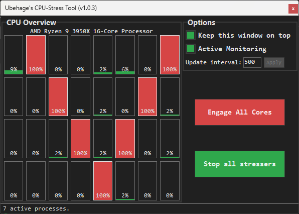

# CPU-Stress Tool (Final release v1)

A minimal, deterministic CPU stress and control tool with per-core precision.

The application allows explicit control over each logical processor using isolated worker processes, providing predictable load behavior and a responsive UI even under full system stress.

---

## Features
- Per-core CPU stress control (one process per logical core)
- Visual overview of all logical processors
- Click individual cores to start/stop stress
- One-click “Engage all cores”
- One-click global stop
- Optional live CPU load monitoring
- UI remains responsive even at 100% CPU load
- Automatic cleanup: all stress processes terminate when the main window closes

  
## Safety notice
- This software intentionally generates sustained high CPU load.
- Prolonged use can cause thermal throttling, instability, or hardware damage.
- Use at your own risk.
- Recommended environments:
    - Test machines
    - Virtual machines
    - Systems with active thermal monitoring

## Screenshot

## License
- MIT License. All code is free to use and modify.
