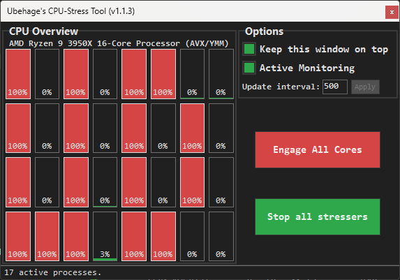

# CPU-Stress Tool (1.1.3)

A small and portable CPU stress tool with full user-control over each logical processor.

## Screenshot

## Features
- Per-core CPU stress control (one process per logical core)
- Visual overview of all logical processors
- Click individual cores to start/stop stress
- One-click “Engage all cores”
- One-click global stop
- Optional live CPU load monitoring
- UI remains responsive even at 100% CPU load
- Automatic cleanup: all stress processes terminate when the main window closes
  
## Safety notice
- This software intentionally generates sustained high CPU load.
- Prolonged use can cause thermal throttling, instability, or hardware damage.
- Use at your own risk.
- Recommended environments:
    - Test machines
    - Virtual machines
    - Systems with active thermal monitoring

## Recent changes:  
(1.1.3):  
- Added another stress-loop for YMM-registers.
- Currently working on:
  - Option to select between technologies.
  - More stress-loops for more cpus.
  
(1.1.2):  
- Fixed a few small typos in CPUView.
- Fixed: CPUView could crash the program and IDE if you loaded more than one instance of the control.
- Fixed a small logical error when closing the main window.
  
(1.1.1):  
- Removed some accidental debugging code.
- Increased workload for stress-module.
  
(1.1):  
- Rewrote the stress-algorithm in assembly to generate much more heat on modern cpu's.
- Added detection of CPU-technologies, and wrote different stress-algorithms for older and newer cpu's.

## License
- MIT License. All code is free to use and modify.
